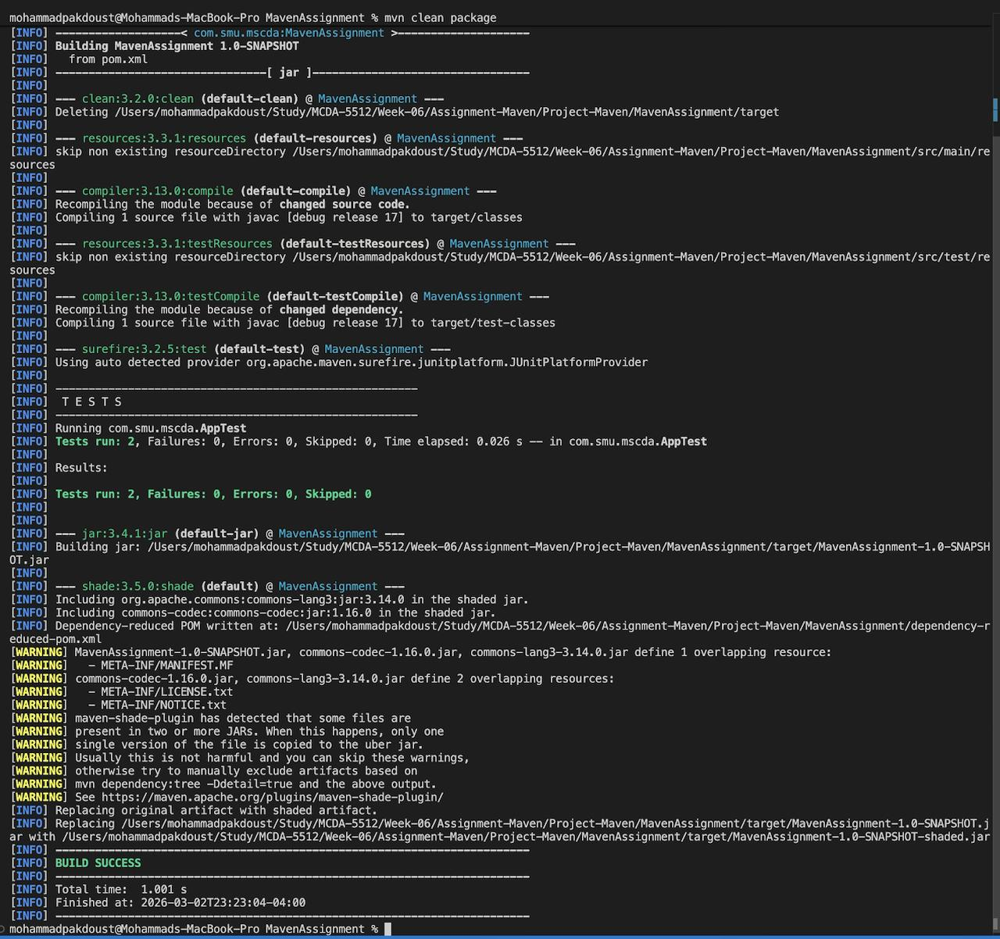
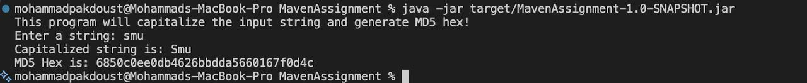

# Maven Assignment

## Overview

This project is a Maven-based Java application for the MCDA 5512 Maven assignment.
It reads a string from user input, capitalizes it, and generates its MD5 hash.

## Requirements

- Java 17
- Apache Maven

## Project Structure

```text
MavenAssignment/
├── pom.xml
├── dependency-reduced-pom.xml
├── screenshots/
│   ├── 1.jpg
│   └── 2.jpg
├── src/
│   ├── main/
│   │   └── java/com/smu/mscda/App.java
│   └── test/
│       └── java/com/smu/mscda/AppTest.java
└── target/
```

### Key Files

- `src/main/java/com/smu/mscda/App.java`: Main application logic
- `src/test/java/com/smu/mscda/AppTest.java`: Unit tests
- `pom.xml`: Dependencies and plugin configuration

## How to Build

```bash
mvn clean package
```

## How to Run

```bash
java -jar target/MavenAssignment-1.0-SNAPSHOT.jar
```

## Tests

The project includes JUnit 5 tests for string capitalization and MD5 hash generation.

```bash
mvn test
```

## Dependencies

- `org.apache.commons:commons-lang3:3.14.0`
- `commons-codec:commons-codec:1.16.0`
- `org.junit.jupiter:junit-jupiter:5.10.2` (test scope)

## Bonus (Fat JAR)

The project uses the Maven Shade Plugin to package an executable fat JAR.

## Screenshots

### Screenshot 1



### Screenshot 2



## Author

- Name: Mohammad Pakdoust
- A-number: A00478211
